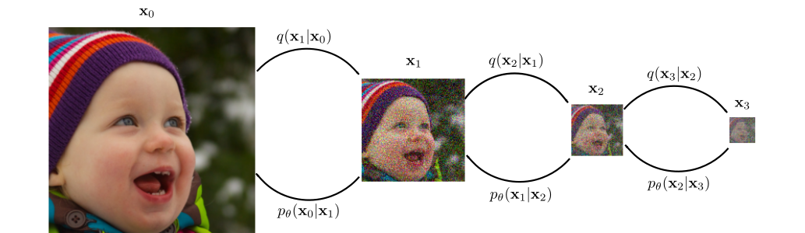
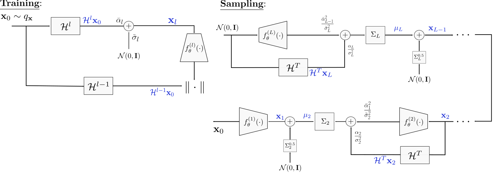

## [UDPM] : Upsampling Diffusion Probabilistic Models

**This repository contains the official code and resources for training and sampling of [UDPM](https://arxiv.org/abs/2305.16269).**

***Abstract:***
Denoising Diffusion Probabilistic Models (DDPM) have recently gained significant attention. DDPMs compose a Markovian process that begins in the data domain and gradually adds noise until reaching pure white noise. DDPMs generate high-quality samples from complex data distributions by defining an inverse process and training a deep neural network to learn this mapping. However, these models are inefficient because they require many diffusion steps to produce aesthetically pleasing samples. Additionally, unlike generative adversarial networks (GANs), the latent space of diffusion models is less interpretable. In this work, we propose to generalize the denoising diffusion process into an Upsampling Diffusion Probabilistic Model (UDPM). In the forward process, we reduce the latent variable dimension through downsampling, followed by the traditional noise perturbation. As a result, the reverse process gradually denoises and upsamples the latent variable to produce a sample from the data distribution. We formalize the Markovian diffusion processes of UDPM and demonstrate its generation capabilities on the popular FFHQ, AFHQv2, and CIFAR10 datasets. UDPM generates images with as few as three network evaluations, whose overall computational cost is less than a single DDPM or EDM step, while achieving an FID score of 6.86. This surpasses current state-of-the-art efficient diffusion models that use a single denoising step for sampling. Additionally, UDPM offers an interpretable and interpolable latent space, which gives it an advantage over traditional DDPMs.
  





### Getting Started

1. **Clone the repository:**
   ```sh
   git clone https://github.com/shadyabh/UDPM.git
2. **Install dependencies:**
   
   See `requirements.txt` for instructions.
5. **Download the** [pre-trained models](https://drive.google.com/drive/folders/1hYIpASc2zrkV2p-E9SKlAzDf0E6TzPIh?usp=sharing)
6. **Inference**
  
   Instructions for running inference.

    * Generate images from CIFAR10:
      ```
      python sample.py --checkpoints_dir <<CHECKPOINTS DIRECTORY>> --batch_size 1 --suffix UDPM32_CIFAR10 --img_size 32 --classes_num 10 --use_ema --n_samples 10 --net_type NCSN --            num_blocks_per_res 4 --model_channels 128 --model_ch_mult 2 2 2 --model_att_res 16 --t_type discrete --out_dir <<OUTPUT DIRECTORY>>
      ```
    * Generate images from AFHQv2:
      ```
      python sample.py --checkpoints_dir <<CHECKPOINTS DIRECTORY>> --batch_size 1 --suffix UDPM64_AFHQv2 --img_size 64 --classes_num 0 --use_ema --n_samples 10 --net_type NCSN --num_blocks_per_res 4 --model_channels 128 --model_ch_mult 1 2 2 2 --model_att_res 16 --t_type discrete --out_dir <<OUTPUT DIRECTORY>>
      ```
9. **Training**

   Instructions for training the model.

   * Train UDPM on 32x32 images from CIFAR10:
      ```
      python train_DDP.py --training_steps 600000  --batch_per_GPU 64   --checkpoints_dir <<CHECKPOINTS_DIR>> --data_dir <<DATA_DIR>> --num_workers 4 --lr 1e-4 --lr_disc 1e-4 --suffix UDPM64_AFHQv2  --img_size 32 --epochs 100000 --EMA_weight 0.9999 --classes_num 10 --print_interval 100  --save_every 5000  --model_channels 128 --channels_mult 2 2 2 --attention_res 8 4 2  --net_type NCSN --num_blocks_per_res 4 --warmup_steps 5000 --disc_channels 192 --diffusion_steps 3 --alphas 0.5 0.2 1e-3 --sigmas 0.1 0.2 0.3 --disc_weight 2e-1 5e-1 1 --l1_weight 1 1 0 --lpips_weight 4 4 0 --dropout 0 --disc_dropout 0.4 --normalize_loss_inp --disc_loss_type noisy --disc_grad_pen 0.025 0.1 0.4 --disc_loss_type noisy --noisy_disc_std 0.4 --noisy_disc_std_factor 0.99 --class_disc  --use_amp
      ```

    * Train UDPM on 64x64 images from FFHQ:
      ```
      python train_DDP.py --training_steps 600000  --batch_per_GPU 64 --checkpoints_dir <<CHECKPOINTS_DIR>> --data_dir <<DATA_DIR>>  --num_workers 4 --lr 1e-4 --lr_disc 1e-4 --suffix UDPM64_AFHQv2 --img_size 64 --epochs 100000 --EMA_weight 0.9999 --classes_num 0 --print_interval 100  --save_every 5000  --model_channels 128 --channels_mult 1 2 2 2 --attention_res 16 8 4  --net_type NCSN --num_blocks_per_res 4 --warmup_steps 5000 --disc_channels 192 --diffusion_steps 3 --alphas 0.5 0.2 1e-3 --sigmas 0.1 0.2 0.3 --disc_weight 2e-1 5e-1 1 --l1_weight 1 1 0 --lpips_weight 4 4 0 --dropout 0 --disc_dropout 0.2 --normalize_loss_inp --disc_loss_type noisy --disc_grad_pen 0.1 0.4 0.8 --noisy_disc_std 0.4 --noisy_disc_std_factor 0.99  --use_amp
      ```

    * Train UDPM on 64x64 images from AFHQv2:
      ```
      python train_DDP.py --training_steps 600000  --batch_per_GPU 64 --checkpoints_dir <<CHECKPOINTS_DIR>> --data_dir <<DATA_DIR>> --num_workers 4 --lr 1e-4 --lr_disc 1e-4 --suffix UDPM64_AFHQv2 --img_size 64 --epochs 100000 --EMA_weight 0.9999 --classes_num 0 --print_interval 100  --save_every 5000  --model_channels 128 --channels_mult 1 2 2 2 --attention_res 16 8 4  --net_type NCSN --num_blocks_per_res 4 --warmup_steps 5000 --disc_channels 192 --diffusion_steps 3 --alphas 0.5 0.2 1e-3 --sigmas 0.1 0.2 0.3 --disc_weight 2e-1 5e-1 1 --l1_weight 1 1 0 --lpips_weight 4 4 0 --dropout 0.1 --disc_dropout 0.3 --normalize_loss_inp --disc_loss_type noisy --disc_grad_pen 0.1 0.4 0.8 --noisy_disc_std 0.4 --noisy_disc_std_factor 0.99  --use_amp
      ```
    
### Notes

  *  Replace placeholders such as <CHECKPOINTS_DIRECTORY>, <OUTPUT_DIRECTORY>, <CHECKPOINTS_DIR>, and <DATA_DIR> with appropriate paths.
  * Ensure you have the necessary permissions and access to the data directories and pre-trained models.
